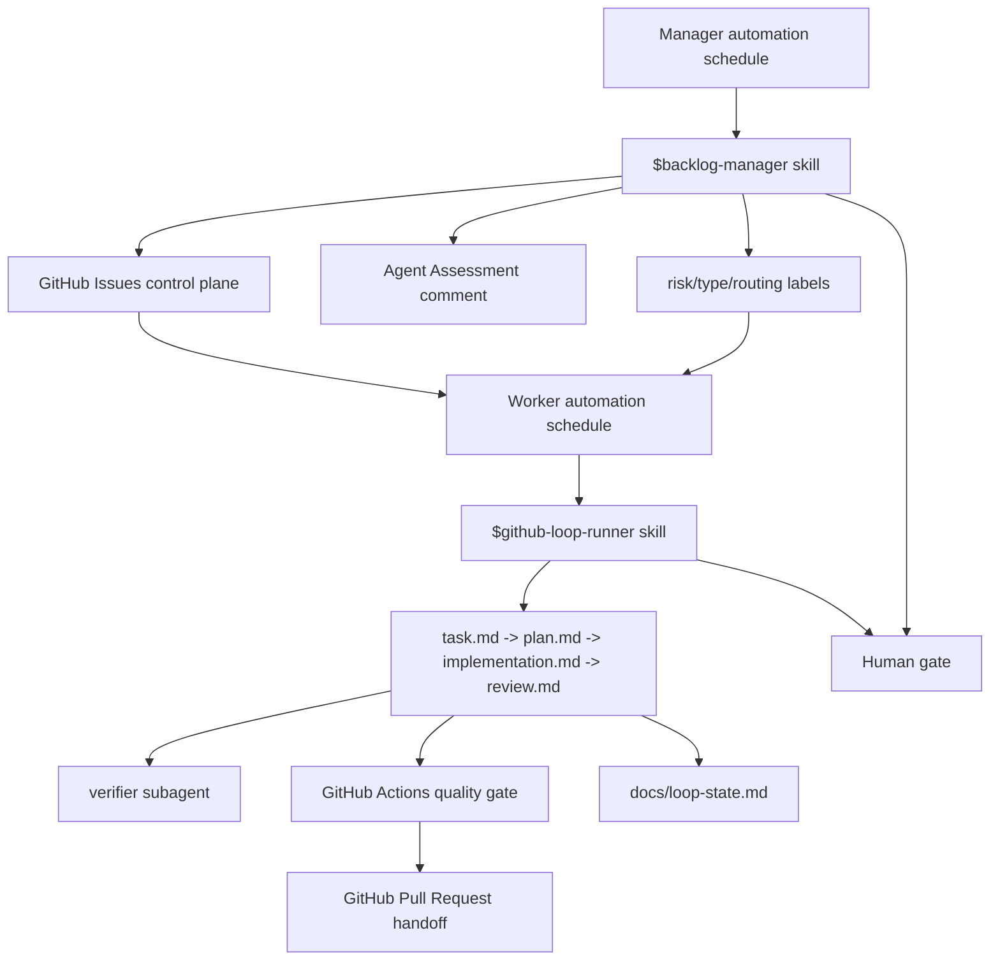

# Loop Engineering Workshop Guide

Loop engineering means designing the system that prompts the agent instead of manually prompting every step.

In this repository, the system is deliberately small and split into two loops:

## The Six Elements

| Element | Where it appears |
| --- | --- |
| Automations | Manager and worker scheduled Codex automations |
| Worktrees | Automation setup recommends background worktrees |
| Skills | Two core skills: `backlog-manager` and `github-loop-runner` |
| Plugins/connectors | Live mode uses GitHub connector or `gh`; offline mode uses sample files |
| Subagents | `.codex/agents/verifier.toml` checks implementation |
| State | GitHub Issues plus `docs/loop-state.md` and loop artifacts |

## Why Two Loops

The manager loop decides what is safe. The worker loop acts only on safe work.

This prevents the worker from choosing its own task, widening scope, or treating a vague issue as permission to code.

## Manager Loop

The manager loop:

- reads open issues
- classifies risk and type
- writes an Agent Assessment
- grants `agent:ready` only to clear, low-risk work
- marks ambiguous work `needs:human` with a specific question

It never writes code.

## Worker Loop

The worker loop:

- picks one `risk:low` + `agent:ready` issue
- reads the Agent Assessment
- creates lightweight artifacts: `task.md`, `plan.md`, `implementation.md`, `review.md`
- implements one small repo utility
- runs tests
- asks the verifier agent to review
- prepares PR handoff

It never merges code.

## Why The Example Is A Markdown Link Checker

The code example is intentionally boring. A Markdown link checker is related to repository maintenance, has clear tests, and does not distract from the automation and skill design.

## Human In The Loop

The human controls:

- whether manager apply mode is allowed
- answers to `needs:human` questions
- plan approval through `loop:plan-approved`
- push and pull request creation
- final PR review and merge

## Durable State

GitHub Issues are the main control plane in live mode. `docs/loop-state.md` mirrors local progress and keeps offline workshop runs explainable.

## Workshop Constraint

This repo intentionally avoids complex app architecture. The utility is tiny so the loop mechanics remain visible.
